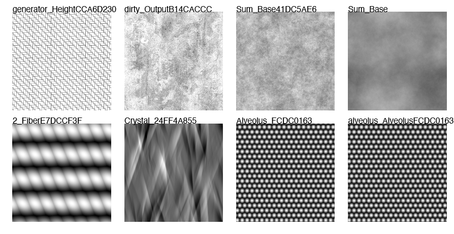
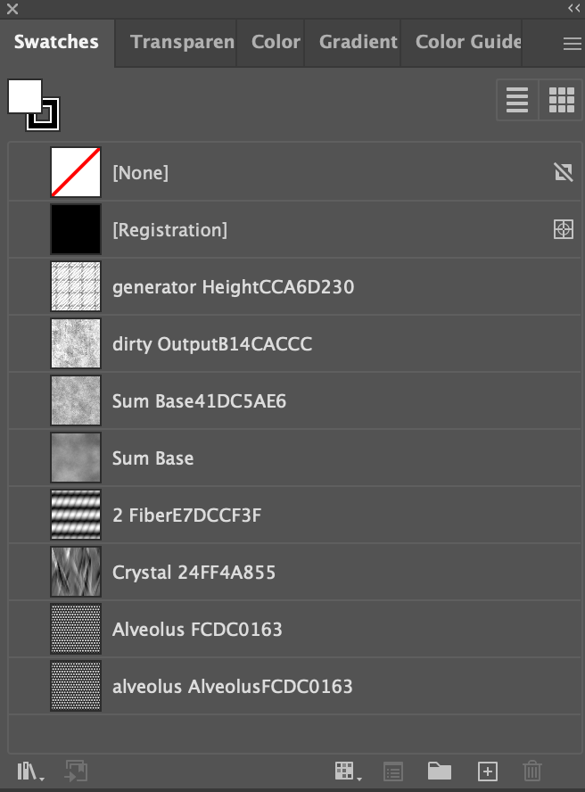

# <h1 align="center">Welcome to @gbt/svg-swatch👋</h1>

-   Turns a directory of images into a swatch legend



-   Use the patterns in the swatch panel on illustrator 

#### Repository

[snailicide-monorepo](https://github.com/gbtunney/snailicide-monorepo.git)

#### Author

👤 **Gillian Tunney**

-   [github](https://github.com/gbtunney)
-   [email](mailto:gbtunney@mac.com)

> Important! Suggested package manager is [pnpm](https://pnpm.io)

## @gbt/svg-swatch

---

### Installation

This library is published in the NPM registry and can be installed using any compatible package manager as a development dependency.

```sh
pnpm add @gbt/svg-swatch -D

## For pnpm workspace, use the command below.
pnpm add @gbt/svg-swatch@workspace:* -D
```

### Commands

```sh

SVG Swatch : Creates an svg out of the images
$ svg-swatch [args]

Options:
  -h, --help           Show help                                       [boolean]
  -v, --version        Show version number                             [boolean]
  -r, --rootDir        <dir> Set Root Directory                         [string]
  -f, --outFile        Output file name with no extension               [string]
  -o, --outDir         <dir> Output directory                           [string]
  -d, --debug          Debug output                                    [boolean]
      --verbose        Verbose Logging                                 [boolean]
  -i, --inputImages    <glob> Directory containing sbs (Relative to rootDir)
                       NO
                       TE: If using glob USE QUOTES OR WILL ONLY GET 1 file
                                                                        [string]
  -c, --columns        Swatch grid columns                              [number]
  -t, --patternTiling  <int>Swatch pattern scale (controls swatch tiling)
                                                                        [number]
  -w, --svgWidth       Viewbox width in pixels (integer)                [number]
  -g, --gutter         gutter size in pixels (integer)                  [number]
      --delimiter      <string> Filename delimiter                      [string]
```

> Note: The value of the viewBox attribute is a list of four numbers: min-x, min-y, width and height
